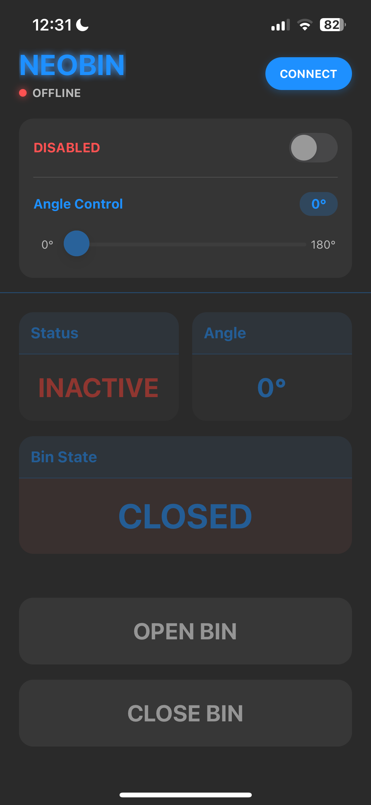
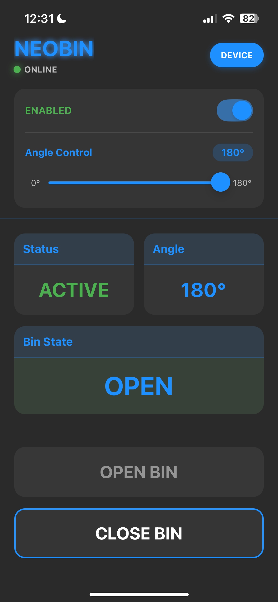
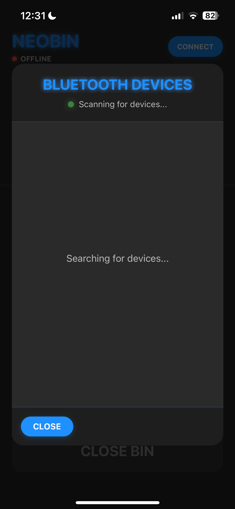
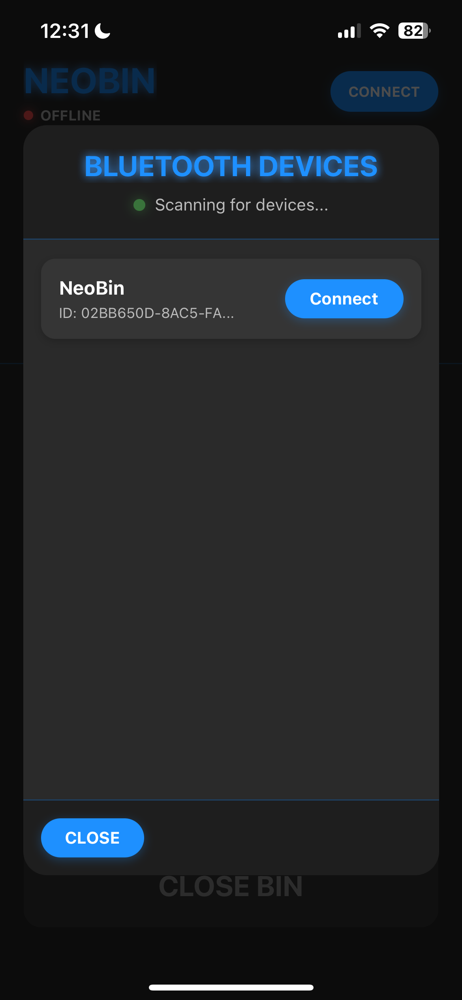
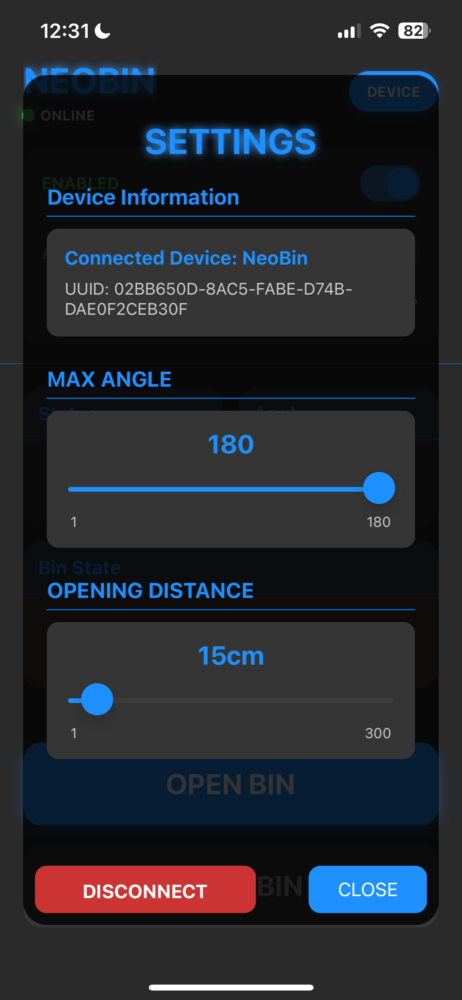

# NeoBin

NeoBin is a smart bin project using Bluetooth Low Energy (BLE) for interactive waste management. It runs on a Raspberry Pi with a Python backend using the BlueZ stack. Features include a GATT service for authentication, command execution, and notifications, and hardware integration with a servo motor and ultrasonic sensor for automated lid control.

## Features

- **Interactive Waste Management:** Utilize BLE for seamless communication with mobile devices.
- **Automated Lid Control:** Integrate a servo motor and ultrasonic sensor for automated opening and closing of the bin lid.
- **GATT Service:** Handle authentication, command execution, and notifications.
- **Real-Time Monitoring:** Receive real-time status updates and notifications from the smart bin.

## Hardware Components

- **Bin:** IKEA Lack 10L bin
- **Servo Motor:** Used for controlling the lid
- **Ultrasonic Sensor:** Used for detecting objects near the bin
- **Raspberry Pi:** Runs the backend software
- **3D Printed Parts:** Custom parts for mounting the servo motor

## Prerequisites

- Raspberry Pi with BlueZ stack installed
- Python 3.7+ for the backend
- Node.js and npm for the frontend (React Native)
- Android Studio or Xcode for mobile app development

## Installation

### Backend

1. **Clone the Repository:**
    ```bash
    git clone https://github.com/Japrolol/NeoBin.git
    cd NeoBin
    ```

2. **Install Python Dependencies:**
    ```bash
    pip install -r backend/requirements.txt
    ```

3. **Run the Backend:**
    ```bash
    python backend/main.py
    ```

### Frontend

1. **Navigate to the Frontend Directory:**
    ```bash
    cd frontend
    ```

2. **Install Dependencies:**
    ```bash
    npm install
    ```

3. **Start the Metro Server:**
    ```bash
    npx react-native start
    ```

4. **Build and Run the App:**

    - **For iOS:**
        ```bash
        npx react-native run-ios
        ```

    - **For Android:**
        ```bash
        npx react-native run-android
        ```

## Configuration

- Configuration settings for the backend can be found in `backend/config.yaml`.
- You may need to modify your Xcode or Gradle settings for the frontend project. Otherwise, everything should be plug and play.

## Usage

- The backend script (`backend/main.py`) initiates the BLE GATT service and handles hardware interactions.
- The frontend interface allows users to interact with the NeoBin backend, open/close the bin lid, view sensor data, and receive notifications.

## Screenshots
<div style="display: flex; flex-direction: row; flex-wrap: wrap; gap: 2rem;">










</div>

## Contributing

1. Fork the repository.
2. Create your feature branch (`git checkout -b feature/AmazingFeature`).
3. Commit your changes (`git commit -m 'Add some AmazingFeature'`).
4. Push to the branch (`git push origin feature/AmazingFeature`).
5. Open a pull request.

## License

Distributed under the MIT License. See `LICENSE` for more information.

## Contact

Japrolol - [GitHub Profile](https://github.com/Japrolol)

Project Link: [https://github.com/Japrolol/NeoBin](https://github.com/Japrolol/NeoBin)
